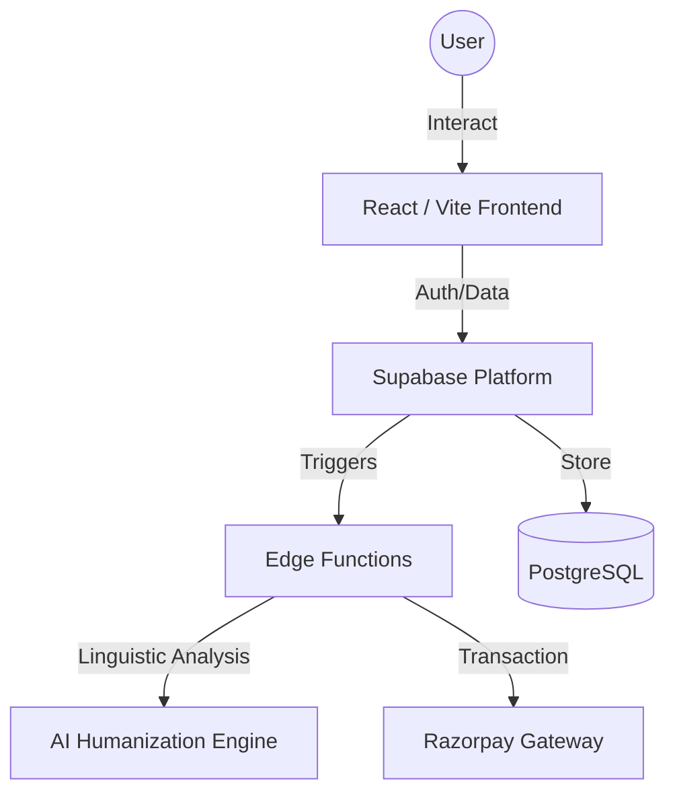

<div align="center">


# RAW.AI

### ⚡ The Gold Standard for AI Text Humanization

**RAW.AI transforms synthetic AI-generated text into authentic, high-impact human writing that bypasses every major detection system on the market.**

[](https://rawai-arshvermagit.vercel.app)
[](https://rawai-arshvermagit.vercel.app)
[](https://opensource.org/licenses/MIT)

<br />

| 🛡️ Security      | ⚡ Speed          | 📊 Precision    | 🌐 Reach          |
| :--------------- | :---------------- | :-------------- | :---------------- |
| **Undetectable** | **< 3s Response** | **99.8% Score** | **50+ Languages** |

</div>

---

## 📖 Table of Contents

- [✨ Key Features](#-key-features)
- [🛠️ Tech Stack](#️-tech-stack)
- [🚀 Getting Started](#-getting-started)
- [📦 Project Architecture](#-project-architecture)
- [📂 Directory Structure](#-directory-structure)
- [💎 Pricing Tiers](#-pricing-tiers)
- [👨‍💻 Team & Contact](#-team--contact)

---

## ✨ Key Features

RAW.AI isn't just a rewriter; it's a sophisticated linguistic engine designed for the "Hyper-Premium" user experience.

- **🧠 Advanced Humanization Engine**: Three distinct modes (Lite, Pro, Ultra) tailored for different levels of linguistic complexity and detection bypass.
- **🛡️ Multi-Detector Bypass**: Built and tested to consistently bypass **GPTZero**, **Turnitin**, **Originality.ai**, **Copyleaks**, and **Writer.com**.
- **🌍 Global Linguistic Support**: Seamlessly humanize content in over 50 languages while maintaining local nuances and idioms.
- **📊 Real-time AI Checker**: Integrated detection tool that breaks down your text sentence-by-sentence to identify "AI signatures" before you publish.
- **🔐 Enterprise-Grade Auth**: Secure onboarding and account management via **Google OAuth** and **Supabase**.
- **💳 Frictionless Payments**: Fully integrated **Razorpay** checkout with real-time usage tracking and credit management.

---

## 🛠️ Tech Stack

### Frontend & UI

- **Framework**: [React 18](https://reactjs.org/) with [Vite](https://vitejs.dev/)
- **Language**: [TypeScript](https://www.typescriptlang.org/)
- **Styling**: [Tailwind CSS](https://tailwindcss.com/)
- **Animations**: [Framer Motion](https://www.framer.com/motion/)
- **Icons**: [Lucide React](https://lucide.dev/)
- **Components**: [Shadcn UI](https://ui.shadcn.com/) (Radix UI)

### Backend & Infrastructure

- **Database & Auth**: [Supabase](https://supabase.com/) (PostgreSQL)
- **Edge Functions**: [Deno](https://deno.com/) runtime for low-latency AI processing
- **Payment Gateway**: [Razorpay](https://razorpay.com/)
- **Hosting**: [Vercel](https://vercel.com/) (Production URL: `https://rawai-arshvermagit.vercel.app`)

---

## 🚀 Getting Started

### Prerequisites

- Node.js 18.x or higher
- A Supabase project
- A Razorpay account (for payments)

### Installation

1. **Clone the Repo**

   ```bash
   git clone https://github.com/ArshVermaGit/RAW-AI.git
   cd RAW-AI
   ```

2. **Install Dependencies**

   ```bash
   npm install
   ```

3. **Configure Environment**
   Create a `.env` file in the root directory:

   ```env
   VITE_SUPABASE_URL=your_supabase_url
   VITE_SUPABASE_PUBLISHABLE_KEY=your_anon_key
   ```

4. **Launch Development Server**
   ```bash
   npm run dev
   ```

---

## 📦 Project Architecture



---

## 📂 Directory Structure

```text
RAW-AI/
├── public/                # Static assets & SEO files
├── src/
│   ├── components/        # Reusable UI components
│   │   ├── ui/            # Shadcn base components
│   │   └── ...            # Feature-specific components
│   ├── contexts/          # React Context providers (Auth, etc.)
│   ├── hooks/             # Custom React hooks (Usage, Modals)
│   ├── integrations/      # Third-party service clients
│   ├── lib/               # Utility functions
│   └── pages/             # Main application views/routes
├── supabase/              # Database migrations & Edge Functions
└── ...configs             # Vite, Tailwind, TS configs
```

---

## 💎 Pricing Tiers

| Plan      | Word Limit  | Processing | Best For                      |
| :-------- | :---------- | :--------- | :---------------------------- |
| **Lite**  | 5,000/mo    | Fast       | Daily emails & social posts   |
| **Pro**   | Unlimited\* | Deep       | Professional articles & blogs |
| **Ultra** | Unlimited   | Maximum    | Academic papers & legal docs  |

---

## 👨‍💻 Team & Contact

**Arsh Verma** — _Lead Developer & Architect_

<p align="left">
  <a href="mailto:arshverma.dev@gmail.com">
    
  </a>
  <a href="https://github.com/ArshVermaGit">
    
  </a>
  <a href="https://linkedin.com/in/arshvermadev/">
    
  </a>
  <a href="https://x.com/TheArshVerma">
    
  </a>
</p>

---

<div align="center">
  <b>Star this repository if you find it useful! ⭐</b><br />
  Built with passion for the future of authentic AI writing.
</div>
