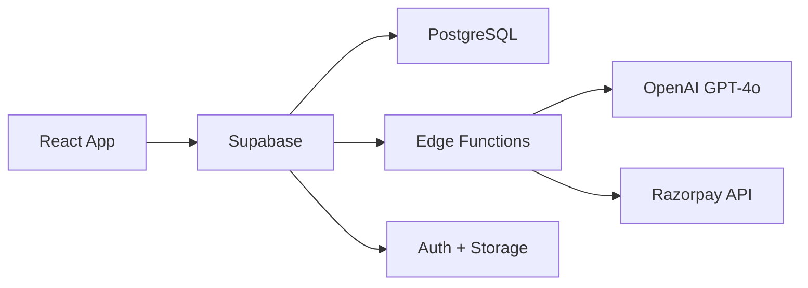

<div align="center">


# RAW.AI

### ⚡ Transform AI Text into Authentic Human Writing

**The most advanced AI humanizer that bypasses all major detection systems**

[](https://rawai-arshvermagit.vercel.app)
[](https://vercel.com/new/clone?repository-url=https://github.com/ArshVermaGit/RAW-AI)

    

<table>
<tr>
<td align="center"><b>99.8%</b><br/>Success Rate</td>
<td align="center"><b>3sec</b><br/>Avg Processing</td>
<td align="center"><b>10K+</b><br/>Active Users</td>
<td align="center"><b>50M+</b><br/>Words Processed</td>
</tr>
</table>

[Report Bug](https://github.com/ArshVermaGit/RAW-AI/issues) · [Request Feature](https://github.com/ArshVermaGit/RAW-AI/issues)

</div>

---

## ✨ Features

<table>
<tr>
<td width="33%" align="center">
<br/>
<b>🧠 3-Tier Humanization</b><br/>
Lite · Pro · Ultra modes<br/>
for every use case
</td>
<td width="33%" align="center">
<br/>
<b>🛡️ Undetectable</b><br/>
Bypasses GPTZero, Turnitin<br/>
Originality.ai & more
</td>
<td width="33%" align="center">
<br/>
<b>💳 Smart Payments</b><br/>
Razorpay integration<br/>
with usage tracking
</td>
</tr>
<tr>
<td width="33%" align="center">
<br/>
<b>🔐 Secure Auth</b><br/>
Google Sign-In<br/>
exclusive access
</td>
<td width="33%" align="center">
<br/>
<b>📊 Real-time Analytics</b><br/>
Track usage, limits<br/>
& subscription status
</td>
<td width="33%" align="center">
<br/>
<b>⚡ Lightning Fast</b><br/>
Built with React, Vite<br/>
& Framer Motion
</td>
</tr>
</table>

---

## 🛠️ Tech Stack

<div align="center">

### Frontend

   

### Backend

  

### Services

 

</div>

---

## 🚀 Quick Start

```bash
# Clone repository
git clone https://github.com/ArshVermaGit/RAW-AI.git
cd RAW-AI

# Install dependencies
npm install

# Setup environment
cp .env.example .env
# Add your Supabase credentials to .env

# Start dev server
npm run dev
```

### Environment Variables

```env
VITE_SUPABASE_URL=https://your-project.supabase.co
VITE_SUPABASE_PUBLISHABLE_KEY=your_anon_key
```

---

## 📦 Architecture



<div align="center">

**User Input** → **Supabase Edge Function** → **OpenAI Humanization** → **Undetectable Output**

</div>

---

## 🎯 Usage Modes

| Mode         | Processing Time | Word Limit | Detection Score | Best For            |
| ------------ | --------------- | ---------- | --------------- | ------------------- |
| **🌟 Lite**  | ~2s             | 1,000      | 85-90% human    | Quick edits, emails |
| **💎 Pro**   | ~4s             | 2,500      | 93-96% human    | Articles, reports   |
| **🚀 Ultra** | ~6s             | 5,000      | 98-99% human    | Academic papers     |

---

## 🗺️ Roadmap

- [x] Core humanization engine
- [x] Three-tier processing (Lite/Pro/Ultra)
- [x] Razorpay subscription management
- [x] Google OAuth exclusive access

---

## 🤝 Contributing

Contributions are welcome! Please follow these steps:

1. Fork the project
2. Create your feature branch (`git checkout -b feature/AmazingFeature`)
3. Commit changes (`git commit -m 'Add AmazingFeature'`)
4. Push to branch (`git push origin feature/AmazingFeature`)
5. Open a Pull Request

---

## 📄 License

Distributed under the **MIT License**. See `LICENSE` for more information.

---

## 👨‍💻 Built By

<div align="center">

### Arsh Verma

**Full-Stack Developer | AI Enthusiast | Open Source Contributor**

<p>
<a href="mailto:ARSHVERMA.DEV@GMAIL.COM">

</a>
<a href="https://github.com/ArshVermaGit">

</a>
<a href="https://linkedin.com/in/arshverma">

</a>
<a href="https://twitter.com/arshverma">

</a>
</p>

---

⭐ **Star this repo if you find it useful!** ⭐

Built with ❤️ using React, Supabase & OpenAI

</div>
