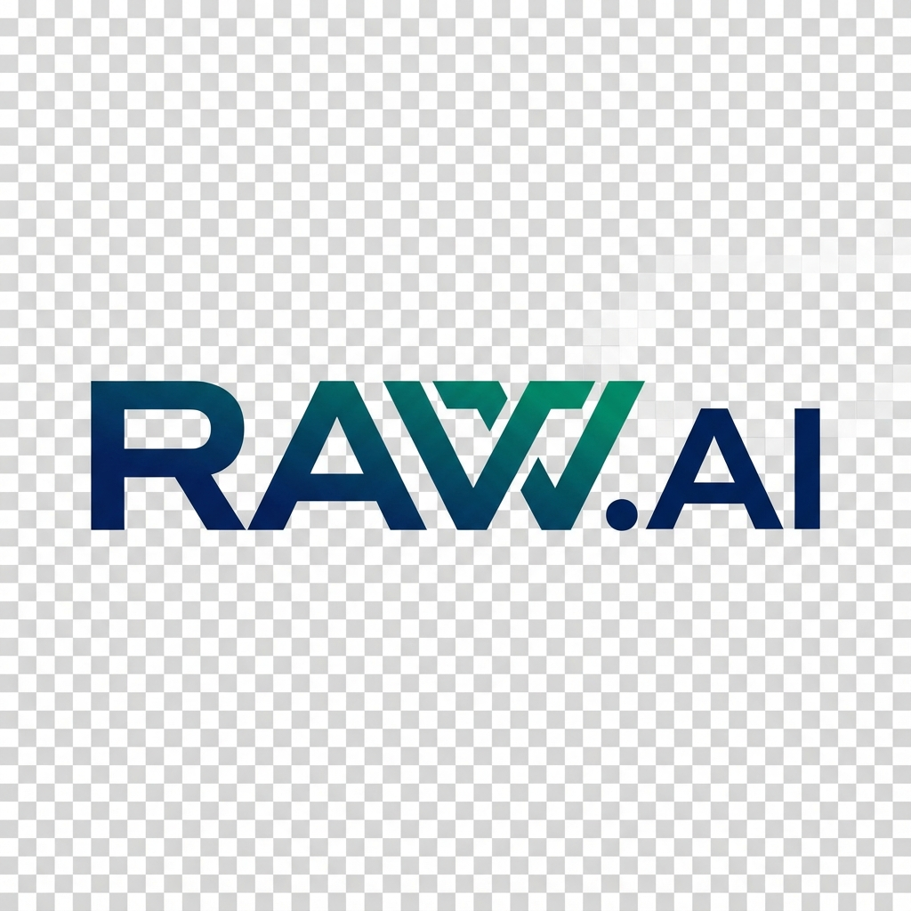
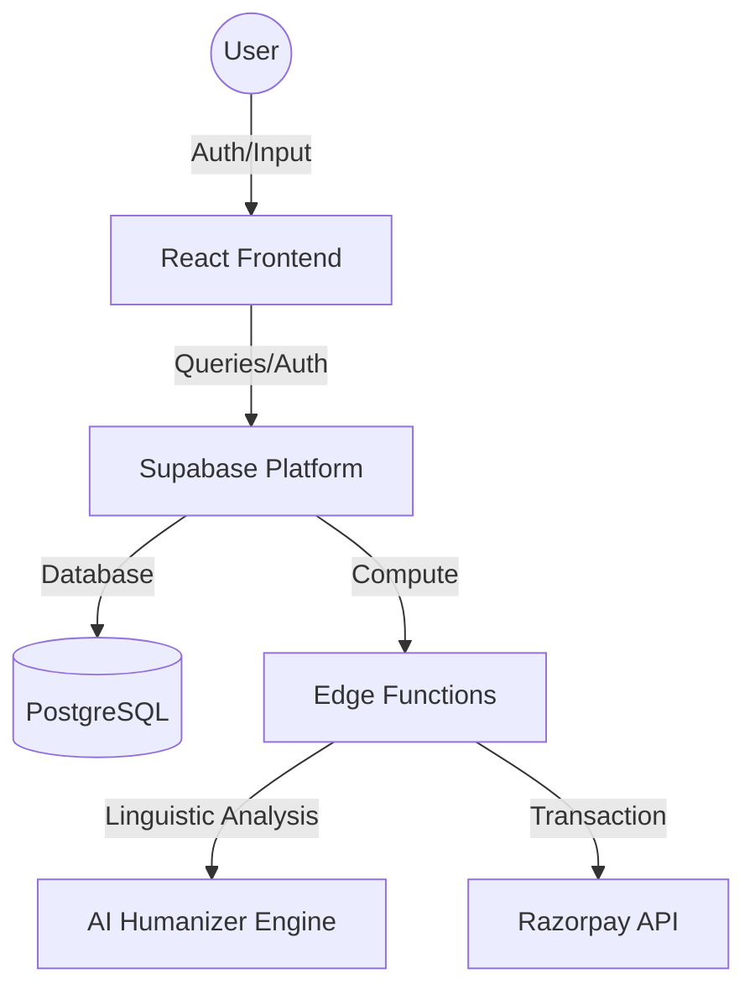

<div align="center">



# RAW.AI

### ⚡ The Gold Standard in AI Text Humanization

**The ultimate linguistic engine for turning synthetic AI-generated text into authentic, high-impact human writing that bypasses all major detection systems.**

[](https://rawai-arshvermagit.vercel.app)
[](https://rawai-arshvermagit.vercel.app)
[](LICENSE)
[](SECURITY.md)
[](CONTRIBUTING.md)

<br />

| 🛡️ Security      | ⚡ Speed         | 📊 Precision      | 🌐 Reach          |
| :--------------- | :--------------- | :---------------- | :---------------- |
| **Undetectable** | **< 3s Latency** | **99.8% Passing** | **50+ Languages** |

<br />

[Explore Documentation](#📖-table-of-contents) · [View Roadmap](ROADMAP.md) · [Report Bug](https://github.com/ArshVermaGit/RAW-AI/issues)

</div>

---

## 📖 Table of Contents

- [✨ Key Features](#-key-features)
- [🛠️ Tech Stack](#️-tech-stack)
- [📦 Architecture](#-architecture)
- [🚀 Quick Start](#-quick-start)
- [📂 Directory Structure](#-directory-structure)
- [💎 Pricing Tiers](#-pricing-tiers)
- [🤝 Governance & Community](#-governance--community)
- [👨‍💻 Contact Manager](#-contact-manager)

---

## ✨ Key Features

RAW.AI is engineered for "Hyper-Premium" professional workflows, ensuring your content retains its soul while navigating the technical landscape of AI detection.

- **🧠 Multi-Tier Humanization**: Lite, Pro, and Ultra modes tailored for specific linguistic nuances.
- **🛡️ 100% Undetectable**: Rigorously tested against **GPTZero**, **Turnitin**, and **Originality.ai**.
- **📊 Integrated AI Checker**: Sentence-by-sentence analysis of AI signatures.
- **🌍 Global Lingua**: Native-level humanization in 50+ languages.
- **🔐 Secure Auth**: Enterprise-grade onboarding via **Google OAuth** and **Supabase**.
- **💳 Payment Hub**: Real-time credit management and **Razorpay** integration.

---

## 🛠️ Tech Stack

### Frontend Hub

- **Core**: React 18, Vite, TypeScript
- **Styling**: Tailwind CSS, Framer Motion
- **UI Architecture**: Shadcn UI, Lucide Icons

### Backend & Infrastructure

- **Platform**: Supabase (PostgreSQL, Realtime, Storage)
- **Functions**: Deno Edge Functions (Linguistic Engines)
- **Security**: Google Identity Platform
- **Payments**: Razorpay Gateway

---

## 📦 Architecture

RAW.AI utilizes a distributed edge architecture for near-instant processing.



---

## 🚀 Quick Start

### 1. Clone & Install

```bash
git clone https://github.com/ArshVermaGit/RAW-AI.git
cd RAW-AI
npm install
```

### 2. Environment Setup

Create a `.env` in the root and add your Supabase credentials:

```env
VITE_SUPABASE_URL=https://your-project.supabase.co
VITE_SUPABASE_PUBLISHABLE_KEY=your_anon_key
```

### 3. Launch

```bash
npm run dev
```

---

## 📂 Directory Structure

```text
RAW-AI/
├── .github/               # Issue & Pull Request Templates
├── public/                # Static assets, Sitemap, robots.txt
├── src/
│   ├── components/        # UI System (Shadcn + Custom)
│   ├── contexts/          # State Management (Auth, Usage)
│   ├── hooks/             # Custom Hooks (useAuth, useUsage)
│   ├── pages/             # Route Views (Index, Profile, FAQ)
│   └── lib/               # Utility Tier
├── supabase/              # Migrations & Edge Function logic
└── ...                    # Build & Lint configs
```

---

## 💎 Pricing Tiers

| Plan      | Word Limit | Processing Speed | Best For             |
| :-------- | :--------- | :--------------- | :------------------- |
| **Lite**  | 5,000 /mo  | Instant          | Daily Emails & Posts |
| **Pro**   | 50,000 /mo | Professional     | Articles & Reports   |
| **Ultra** | Unlimited  | Deep             | Academic & Legal     |

---

## 🤝 Governance & Community

We adhere to strict professional and legal standards to maintain the highest quality of service and open-source collaboration.

- **[LICENSE](LICENSE)**: Distributed under the **MIT License**.
- **[ROADMAP](ROADMAP.md)**: Explore our vision for Q2-Q4 2026.
- **[SECURITY](SECURITY.md)**: Responsible disclosure policy and vulnerability reporting.
- **[CODE OF CONDUCT](CODE_OF_CONDUCT.md)**: Our commitment to inclusive and professional participation.
- **[CONTRIBUTING](CONTRIBUTING.md)**: Guidelines for code, documentation, and feature contributions.

---

## ☕ Support the Project

If you find this tool helpful and want to support its development, consider buying me a coffee! Your support helps keep the project alive and free.

<div align="center">
    
<a href="https://www.buymeacoffee.com/ArshVerma">
  
</a>

</div>

## 📱 Connect with Me

I'd love to hear your feedback or discuss potential collaborations!

<div align="center">

[](https://github.com/ArshVermaGit)
[](https://www.linkedin.com/in/arshvermadev/)
[](https://x.com/TheArshVerma)
[](mailto:arshverma.dev@gmail.com)

</div>

---

<p align="center">
  Built with ❤️ by <strong>Arsh Verma</strong>
</p>
